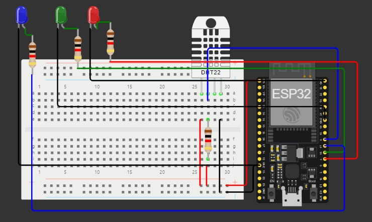

# Monitoring Suhu dan Kelembaban dengan ESP32 dan Sensor DHT22

Proyek ini memanfaatkan ESP32 dan sensor DHT22 untuk memantau suhu dan kelembaban. Indikator LED merah, hijau, dan biru digunakan untuk menunjukkan suhu tertentu:

- **LED merah** menyala jika suhu lebih dari 30°C.
- **LED hijau** menyala jika suhu antara 16°C hingga 30°C.
- **LED biru** menyala jika suhu di bawah 16°C.

## Komponen yang Digunakan

- ESP32
- Sensor DHT22
- 3 LED (Merah, Hijau, Biru)
- Resistor 1kΩ
- Breadboard dan Kabel Jumper

## Diagram Rangkaian
Berikut adalah diagram rangkaian untuk proyek ini:

## Koneksi Pin

- **LED Merah**:
  - **+** (Anoda) ke resistor 1kΩ, lalu dari resistor ke GPIO 4 (Pin 4 di ESP32)
  - **-** (Katoda) langsung ke GND
- **LED Hijau**:
  - **+** ke resistor 1kΩ, lalu dari resistor ke GPIO 16 (Pin 16 di ESP32)
  - **-** langsung ke GND
- **LED Biru**:
  - **+** ke resistor 1kΩ, lalu dari resistor ke GPIO 17 (Pin 17 di ESP32)
  - **-** langsung ke GND
- **Sensor DHT22**:
  - **VCC** ke 3.3V (Pin 3.3V di ESP32)
  - **GND** ke GND (Pin GND di ESP32)
  - **Data** ke GPIO 5 (Pin 5 di ESP32)

## Cara Kerja

1. ESP32 membaca data dari sensor DHT22 untuk suhu dan kelembaban.
2. Hasil pembacaan suhu ditampilkan dalam Celsius dan Fahrenheit melalui serial monitor.
3. Berdasarkan suhu yang terbaca, LED menyala dengan aturan berikut:
   - Suhu > 30°C: LED merah menyala.
   - Suhu antara 16°C - 30°C: LED hijau menyala.
   - Suhu < 16°C: LED biru menyala.

## Simulasi di Wokwi

Proyek ini dapat disimulasikan menggunakan platform Wokwi. Gunakan `sketch.ino` untuk program utama, `diagram.json` untuk skema rangkaian, dan pastikan library DHT sudah diinstal.

## Library yang Digunakan

Pastikan untuk menginstal library berikut agar proyek ini dapat berjalan dengan baik:
- [DHT sensor library](https://github.com/adafruit/DHT-sensor-library)
